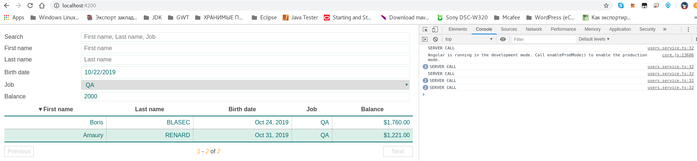

#Smart-Table for Angular

* [part 2](https://itnext.io/smart-table-for-angular-part-2-31ea5bd0c383)
* [Stackblitz Repo](https://stackblitz.com/edit/smart-table-ng-tutorial-2d)



```text
If you have read the previous tutorial or the smart-table-core documentation you already know that smart-table-core instances can be easily extended and there are already quite a few extensions available.
Luckily for us, we can use these extensions (or build our own) within smart-table-ng.
For our use case we may need smart-table-server extension.
```

[Smart Table](https://lorenzofox3.github.io/smart-table-website)

---

[Angular Custom Table Component Paging](https://long2know.com/2017/04/angular-custom-table-component-paging)
[angular-table](http://samu.github.io/angular-table/examples/examples.html)

[grid](https://blog.ag-grid.com/angular-datatables-why-use-one/)
[grid](https://www.ag-grid.com/example.php?_ga=2.237500608.1576274365.1571645586-1597815640.1571645586#/)

https://www.js-tutorials.com/angularjs-tutorial/best-free-angularjs-grid-table-plugin-examples/

http://phpflow.com/demo/angular_datatable_demo/
